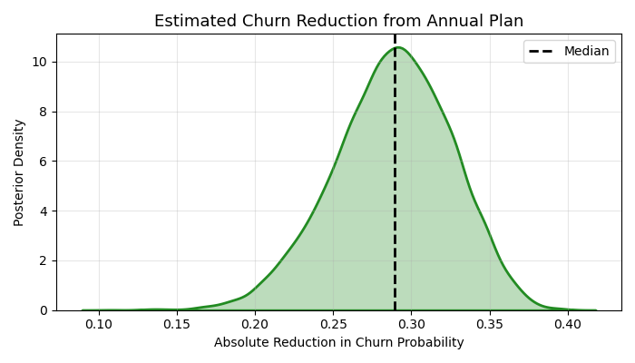

# Streamly: Product Metrics Decomposition and Bayesian Churn Modeling

This project simulates a structured analytics workflow for **Streamly** (a fictional subscription-based streaming platform). It demonstrates how product data scientists can combine behavioral metrics with causal inference methods to evaluate feature impact, optimize retention, and guide pricing strategy.

---

## Project Objectives

- Simulate realistic user-level and event-level data for a subscription business
- Decompose core product metrics (ARPU, retention) to understand cohort behavior
- Estimate the causal effect of subscription plan type (annual vs. monthly) on churn using Bayesian logistic regression
- Translate posterior estimates into actionable insights for product and growth teams

---

## Files and Structure

| File / Notebook | Purpose |
|------------------|---------|
| `01_simulate_data_bayesian_analysis.py` | Generates synthetic user profiles and monthly engagement/churn behavior |
| `02_metrics_teardown.ipynb` | Computes cohort-based retention, ARPU decomposition, and usage trends |
| `03_bayesian_churn.ipynb` | Implements a Bayesian churn model and quantifies uplift from annual plans |
| `data/raw/` | Simulated user and event logs |
| `data/processed/` | Cleaned data tables, cohort summaries, and posterior draws |
| `figures/` | Output plots including retention curves and posterior density estimates |

---

## Key Results

The Bayesian model estimated that users on **annual subscription plans** are significantly less likely to churn compared to monthly subscribers.

- **Estimated uplift:** ~30 percentage point reduction in churn probability
- **Credible interval:** 95% of posterior draws for the treatment effect are below zero
- **Interpretation:** Strong causal evidence that annual plans improve retention, consistent with simulated business logic

---

## Posterior Summary Table

| Parameter       | Mean   | Std Dev | 3% HDI | 97% HDI | R-hat |
|------------------|--------|---------|--------|---------|--------|
| Intercept        | -2.70  | 0.12    | -2.92  | -2.46   | 1.00   |
| Annual Plan Coef | -1.33  | 0.23    | -1.76  | -0.91   | 1.00   |
| Engagement Coef  | -1.95  | 0.13    | -2.21  | -1.71   | 1.00   |

---

## Posterior Visualization

The following plot illustrates the estimated reduction in churn probability when switching from monthly to annual plans, based on posterior samples from the fitted model.

---

## Technical Stack

- Python 3.11
- PyMC 5.x (Bayesian modeling)
- ArviZ (posterior diagnostics and visualization)
- Pandas, NumPy, Seaborn, Matplotlib

---

## Reproducibility

To replicate results:

1. Run `01_simulate_data_bayesian_analysis.py` to generate synthetic data
2. Execute `02_metrics_teardown.ipynb` to compute ARPU and retention metrics
3. Execute `03_bayesian_churn.ipynb` to fit the model and generate posterior summaries

All outputs (figures and processed data) are saved to the appropriate `/figures/` and `/data/processed/` directories.

---

## Summary

This project demonstrates how product data scientists can move beyond point-in-time metrics to:
- Understand how user cohorts behave over time
- Quantify the causal impact of product decisions (e.g., pricing structure)
- Incorporate uncertainty in decision-making using Bayesian methods

It reflects a practical, inference-first approach to retention analytics in subscription-based platforms.
